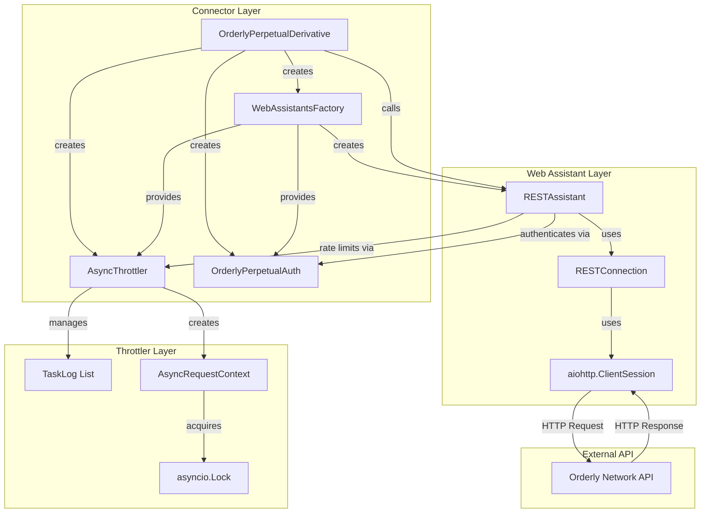
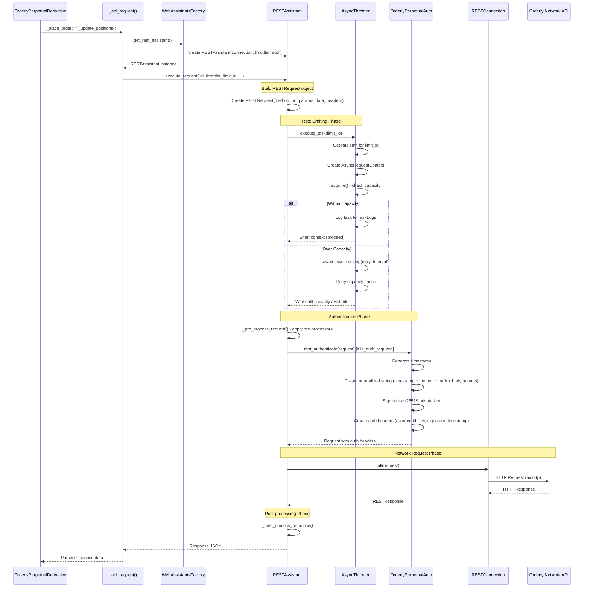
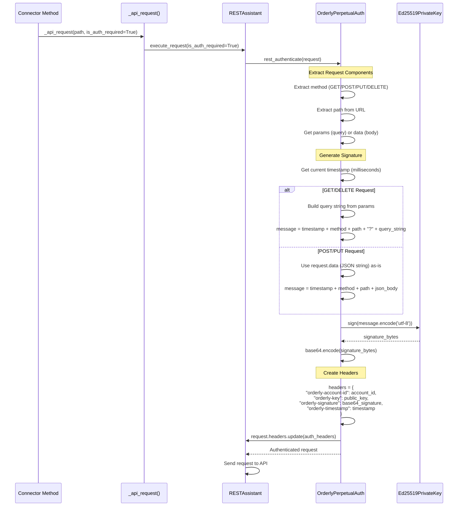
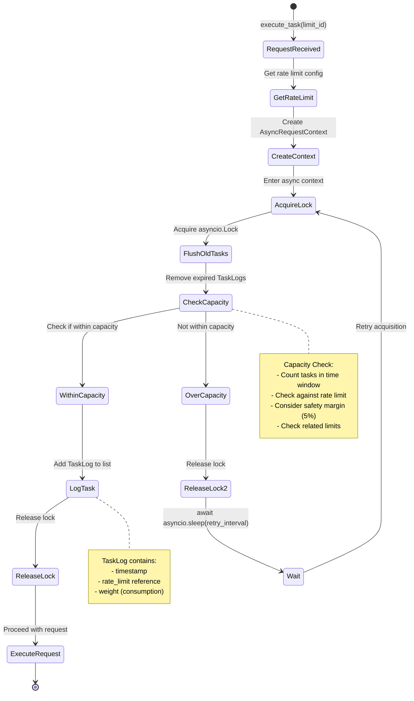
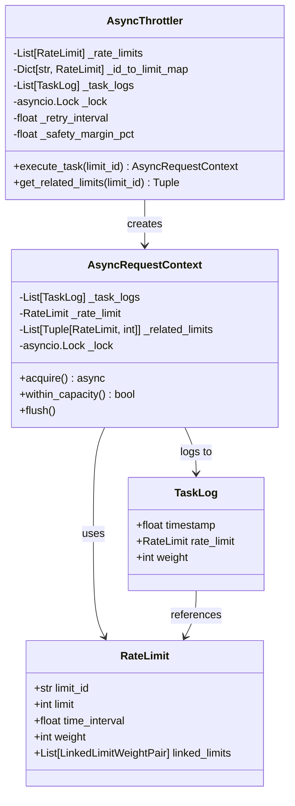
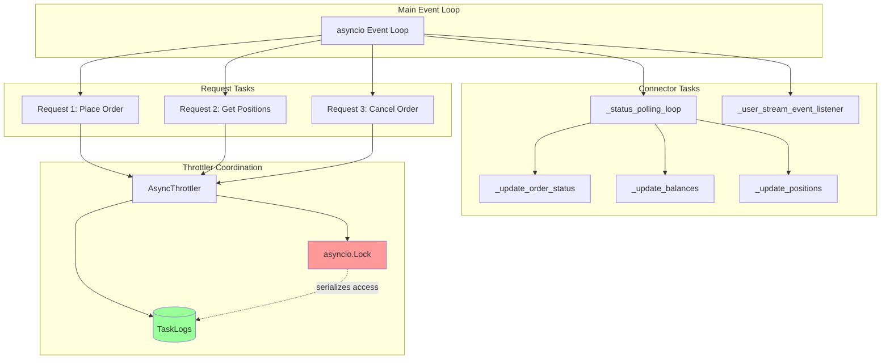
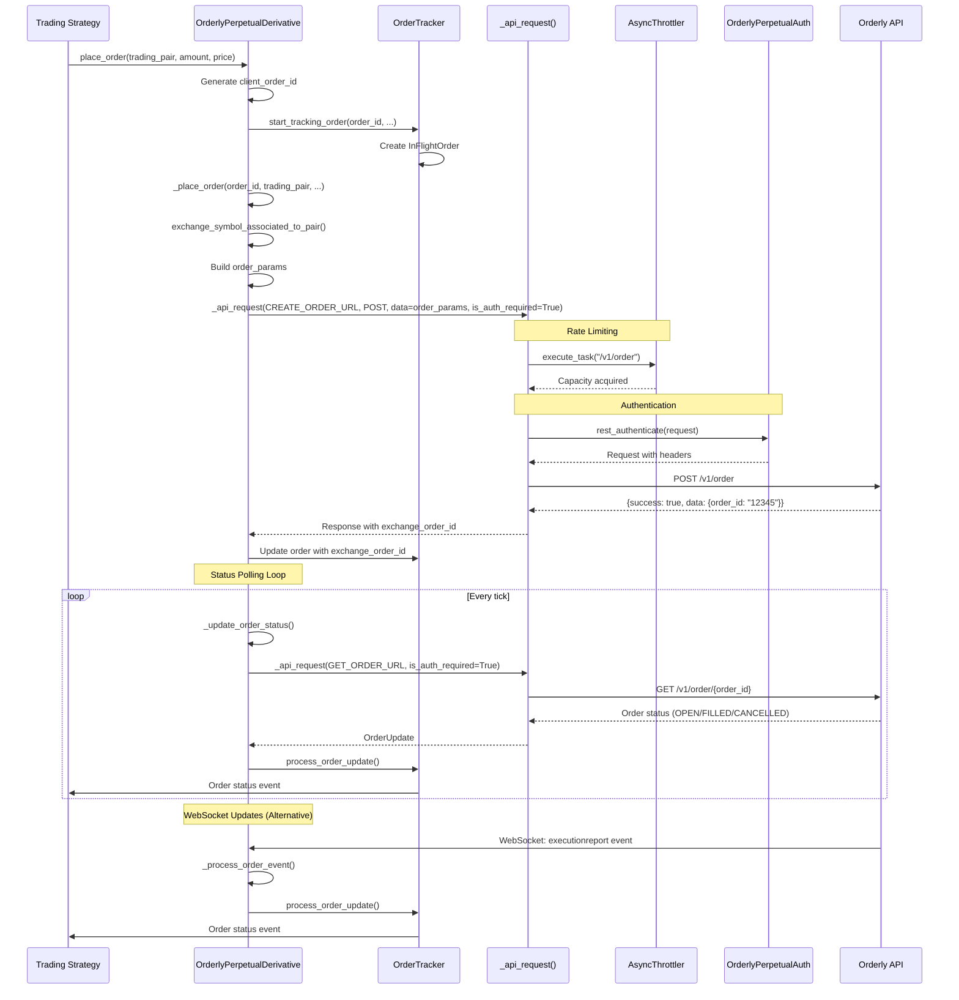
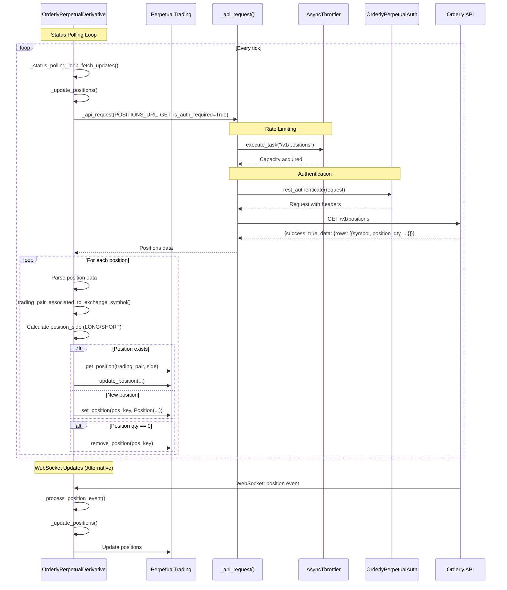

# Connector Architecture: Request Flow, Authentication, and Async Handling

This document explains in detail how Hummingbot connectors handle API requests, authentication, throttling, and async operations.

## Table of Contents
1. [High-Level Architecture](#high-level-architecture)
2. [Request Execution Flow](#request-execution-flow)
3. [Authentication Flow](#authentication-flow)
4. [Throttler Mechanism](#throttler-mechanism)
5. [Async Task Handling](#async-task-handling)
6. [Order Management Flow](#order-management-flow)
7. [Position Management Flow](#position-management-flow)

---

## High-Level Architecture



---

## Request Execution Flow

This diagram shows the complete flow from connector method call to API response:



---

## Authentication Flow

Detailed authentication process for Orderly Network (ed25519 signature-based):



**Key Authentication Points:**
- **Signature Format**: `{timestamp}{method}{path}{body_or_query}`
- **Algorithm**: Ed25519 elliptic curve cryptography
- **Headers Required**: account-id, public key, signature (base64), timestamp
- **Timestamp Window**: Orderly validates timestamps within 300 seconds

---

## Throttler Mechanism

How the throttler manages rate limits and task queuing:



**Throttler Components:**



**Rate Limit Example (Orderly Network):**
```python
RateLimit(
    limit_id="/v1/order",
    limit=100,              # 100 requests
    time_interval=1.0,      # per second
    weight=1,               # consumes 1 unit
    linked_limits=[         # Also consumes from general limit
        LinkedLimitWeightPair(limit_id="general", weight=1)
    ]
)
```

---

## Async Task Handling

How async operations are coordinated:



**Async Coordination Points:**

1. **Throttler Lock**: `asyncio.Lock` ensures only one task can check/modify TaskLogs at a time
2. **Context Manager**: `async with throttler.execute_task()` ensures proper acquisition/release
3. **Non-blocking Wait**: Tasks sleep (`asyncio.sleep`) when over capacity, allowing other tasks to run
4. **Concurrent Requests**: Multiple requests can be in-flight simultaneously, but throttler ensures rate limits

**Example Async Flow:**
```python
# Multiple concurrent requests
async def place_order():
    async with throttler.execute_task("/v1/order"):  # Acquires capacity
        response = await rest_assistant.call(request)  # Non-blocking HTTP call
        return response

# These can run concurrently, but throttler ensures rate limits
task1 = asyncio.create_task(place_order())
task2 = asyncio.create_task(get_positions())
task3 = asyncio.create_task(cancel_order())

results = await asyncio.gather(task1, task2, task3)
```

---

## Order Management Flow

Complete flow for placing and managing orders:



**Order Lifecycle States:**
- `PENDING_CREATE`: Order created locally, waiting for exchange confirmation
- `OPEN`: Order placed on exchange
- `PARTIALLY_FILLED`: Order partially executed
- `FILLED`: Order completely executed
- `CANCELED`: Order cancelled
- `FAILED`: Order failed

---

## Position Management Flow

How positions are fetched and updated:



**Position Update Process:**

1. **Fetch Positions**: GET `/v1/positions` returns all positions
2. **Parse Response**: Extract symbol, quantity, entry price, unrealized PnL
3. **Map Symbols**: Convert exchange symbol (PERP_BTC_USDC) to trading pair (BTC-USDC)
4. **Determine Side**: LONG if quantity > 0, SHORT if quantity < 0
5. **Update State**: Update existing position or create new one
6. **Remove Zero Positions**: If quantity == 0, remove from tracking

---

## Key Components Summary

### 1. **Connector** (`OrderlyPerpetualDerivative`)
- Inherits from `PerpetualDerivativePyBase`
- Manages trading pairs, orders, positions
- Creates `WebAssistantsFactory` with throttler and auth
- Implements order placement, cancellation, status updates
- Implements position fetching and updates

### 2. **WebAssistantsFactory**
- Factory pattern for creating REST/WS assistants
- Injects throttler, auth, and pre/post processors
- Singleton pattern for connection management

### 3. **RESTAssistant**
- Wraps REST connection with throttling and auth
- Applies pre-processors (headers, time sync)
- Applies post-processors (error handling, parsing)
- Manages request lifecycle

### 4. **AsyncThrottler**
- Manages rate limits per endpoint
- Tracks task execution in time windows
- Uses `asyncio.Lock` for thread-safe access
- Implements async context manager for capacity acquisition

### 5. **OrderlyPerpetualAuth**
- Implements `AuthBase` interface
- Generates ed25519 signatures
- Creates normalized strings for signing
- Adds authentication headers to requests

### 6. **RESTConnection**
- Low-level HTTP client wrapper
- Uses `aiohttp.ClientSession`
- Handles actual network I/O

---

## Async Patterns Used

1. **Async Context Managers**: `async with throttler.execute_task()` ensures proper resource management
2. **Async Locks**: `asyncio.Lock` prevents race conditions in throttler
3. **Async Sleep**: Non-blocking waits when over capacity
4. **Task Gathering**: `asyncio.gather()` for concurrent operations
5. **Event Loops**: Status polling runs in background tasks
6. **WebSocket Streams**: Async iterators for real-time updates

---

## Rate Limiting Strategy

The throttler uses a **sliding window** approach:

1. **Task Logs**: Each request logs its execution time and weight
2. **Capacity Check**: Before executing, count tasks within time window
3. **Wait if Over**: If over capacity, wait and retry
4. **Flush Old**: Remove expired task logs periodically
5. **Safety Margin**: Apply 5% safety margin to prevent exceeding limits

**Example:**
- Rate limit: 100 requests/second
- Safety margin: 5%
- Effective limit: 95 requests/second
- If 95 tasks executed in last second, next request waits

---

## Error Handling

1. **Network Errors**: Retried by connection layer
2. **Rate Limit Errors**: Handled by throttler (waits and retries)
3. **Auth Errors**: Propagated to connector (invalid credentials)
4. **API Errors**: Parsed and raised as `IOError` with details
5. **Timeout Errors**: Handled by `wait_for()` with timeout parameter

---

This architecture ensures:
- ✅ **Rate Limit Compliance**: Never exceeds exchange limits
- ✅ **Secure Authentication**: Ed25519 signatures for all requests
- ✅ **Concurrent Operations**: Multiple requests can be in-flight
- ✅ **Efficient Resource Usage**: Shared connections and throttler
- ✅ **Real-time Updates**: WebSocket + polling for order/position updates
- ✅ **Error Resilience**: Proper error handling and retries

